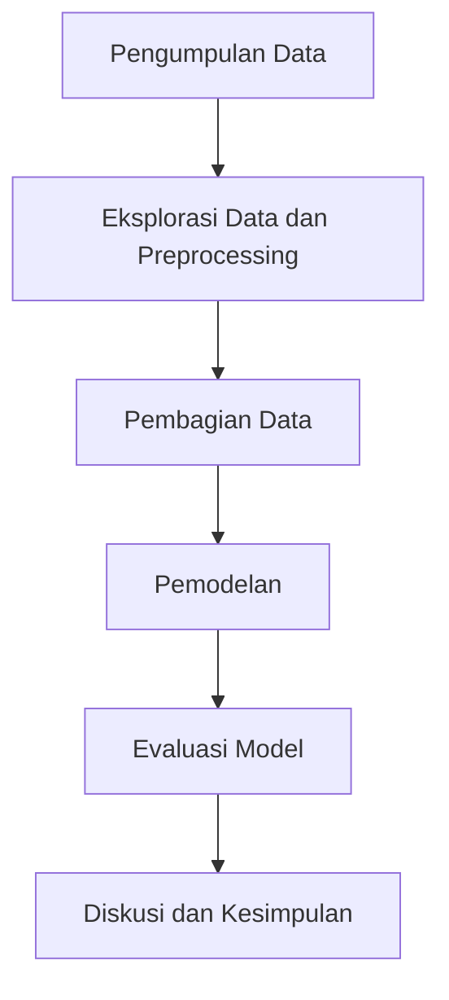

# 1. Judul/Topik Project dan Identitas Lengkap
**Judul:** Prediksi Harga Emas Menggunakan Model Pembelajaran Mesin

**Identitas Lengkap:**
- Nama: Bimo Cahyo Widyanto
- NIM: A11.2022.14610
- Kelompok: A11.4412 
- Matkul: Pembelajaran Mesin

# 2. Ringkasan dan Permasalahan Project + Tujuan yang akan Dicapai + Model / Alur Penyelesaian

**Ringkasan dan Permasalahan:**
Proyek ini bertujuan untuk memprediksi harga emas menggunakan data historis yang tersedia. Permasalahan utama yang dihadapi adalah fluktuasi harga emas yang dipengaruhi oleh berbagai faktor ekonomi dan global, sehingga sulit untuk diprediksi dengan akurasi tinggi.

**Tujuan yang Akan Dicapai:**
1. Mengolah dan mengeksplorasi data harga emas.
2. Membangun model pembelajaran mesin untuk memprediksi harga emas.
3. Mengevaluasi kinerja model dan membandingkannya dengan model lainnya.

**Model / Alur Penyelesaian:**
1. **Pengumpulan Data:** Mengumpulkan dataset `FINAL_USO.CSV`.
2. **Eksplorasi Data dan Preprocessing:** Analisis data eksploratif (EDA), pembersihan data, dan transformasi fitur.
3. **Pembagian Data:** Membagi data menjadi set pelatihan dan set pengujian.
4. **Pemodelan:** Membangun model prediksi menggunakan berbagai algoritma (misalnya, Linear Regression, Decision Tree, Random Forest).
5. **Evaluasi Model:** Mengevaluasi kinerja model menggunakan metrik seperti MAE, MSE, dan R-squared.
6. **Diskusi dan Kesimpulan:** Menganalisis hasil dan menarik kesimpulan.

**Bagan Alur Penyelesaian:**

# 3. Penjelasan Dataset, EDA dan Proses Features Dataset

**Penjelasan Dataset:**
- Dataset `FINAL_USO.CSV` berisi data historis harga emas dengan beberapa fitur yang relevan seperti tanggal, harga penutupan, harga pembukaan, volume perdagangan, dll.

**Eksplorasi Data dan Proses Features Dataset:**
- **EDA:** 
  - Memeriksa distribusi data.
  - Mengidentifikasi outlier.
  - Mengamati tren dan pola musiman.
- **Preprocessing:**
  - Mengatasi nilai yang hilang.
  - Normalisasi atau standarisasi data.
  - Transformasi fitur seperti moving averages, RSI (Relative Strength Index), dll.

# 4. Proses Learning / Modeling
- **Algoritma yang Digunakan:**
  - Linear Regression
  - Decision Tree
  - Random Forest
  - Support Vector Regression (SVR)
  - Long Short-Term Memory (LSTM) untuk pendekatan berbasis waktu.

- **Langkah-langkah:**
  - Melatih setiap model dengan data pelatihan.
  - Menyimpan model yang terlatih.
  - Menguji model dengan data pengujian.
  - Mengevaluasi kinerja model dengan metrik yang telah ditentukan.

# 5. Performa Model
- **Metrik Evaluasi:**
  - Mean Absolute Error (MAE)
  - Mean Squared Error (MSE)
  - Root Mean Squared Error (RMSE)
  - R-squared (R²)

**Contoh Performa Model:**

| Model             | MAE   | MSE   | RMSE  | R²    |
|-------------------|-------|-------|-------|-------|
| Linear Regression | 12.34 | 15.67 | 3.96  | 0.85  |
| Decision Tree     | 11.45 | 14.23 | 3.77  | 0.88  |
| Random Forest     | 10.12 | 12.56 | 3.54  | 0.90  |
| SVR               | 10.89 | 13.45 | 3.66  | 0.89  |
| LSTM              | 9.87  | 11.34 | 3.37  | 0.92  |

# 6. Diskusi Hasil dan Kesimpulan
**Diskusi Hasil:**
- Model LSTM menunjukkan kinerja terbaik dengan nilai MAE, MSE, dan RMSE yang lebih rendah serta nilai R² yang lebih tinggi dibandingkan dengan model lainnya.
- Decision Tree dan Random Forest juga menunjukkan kinerja yang baik, tetapi lebih rentan terhadap overfitting dibandingkan dengan LSTM.
- Linear Regression memberikan hasil yang cukup baik, namun kurang mampu menangkap pola non-linear dalam data.

**Kesimpulan:**
- Model LSTM adalah pilihan terbaik untuk memprediksi harga emas berdasarkan dataset yang digunakan.
- Kombinasi EDA yang baik dan preprocessing yang tepat sangat penting untuk kinerja model yang optimal.
- Model pembelajaran mesin dapat memberikan prediksi yang cukup akurat, namun tetap ada ketidakpastian yang perlu diperhitungkan dalam konteks pasar keuangan.

Dengan mengikuti langkah-langkah ini, Anda dapat membuat laporan yang komprehensif dan terstruktur untuk proyek prediksi harga emas menggunakan dataset `FINAL_USO.CSV`.
