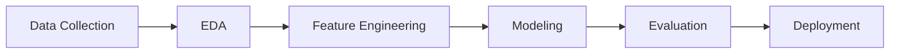

# 1. **Judul/Topik Project dan Identitas Lengkap**
## Prediksi Harga Emas Menggunakan Teknik Machine Learning
### Identitas Lengkap
- Nama: Bimo Cahyo Widyanto
- NIM: A11.2022.14610
- Kelompok: A11.4412 
- Matkul: Pembelajaran Mesin

# 2. Ringkasan dan Permasalahan project + Tujuan yang akan dicapai + Model / Alur Penyelesaian

## Ringkasan
Proyek ini bertujuan untuk memprediksi harga emas berdasarkan data historis dari berbagai sumber seperti ETF Emas, Indeks S&P 500, Dow Jones, dan lainnya.

## Permasalahan
Harga emas dipengaruhi oleh banyak faktor dan fluktuasi pasar yang cepat. Menentukan harga emas yang akurat merupakan tantangan yang memerlukan analisis data yang komprehensif.

## Tujuan
Tujuan dari proyek ini adalah untuk membangun model machine learning yang dapat memprediksi harga penutupan emas berdasarkan data historis yang tersedia.

# 2. Ringkasan dan Permasalahan project + Tujuan yang akan dicapai + Model / Alur Penyelesaian

## Ringkasan
Proyek ini bertujuan untuk memprediksi harga emas berdasarkan data historis dari berbagai sumber seperti ETF Emas, Indeks S&P 500, Dow Jones, dan lainnya.

## Permasalahan
Harga emas dipengaruhi oleh banyak faktor dan fluktuasi pasar yang cepat. Menentukan harga emas yang akurat merupakan tantangan yang memerlukan analisis data yang komprehensif.

## Tujuan
Tujuan dari proyek ini adalah untuk membangun model machine learning yang dapat memprediksi harga penutupan emas berdasarkan data historis yang tersedia.

## Model / Alur Penyelesaian
Berikut adalah alur penyelesaian proyek ini:

Bagan di atas menjelaskan alur penyelesaian proyek ini, mulai dari pengumpulan data, EDA, pemrosesan fitur, hingga model dan evaluasi.

# 3. Penjelasan Dataset, EDA dan Proses Features Dataset
## Penjelasan Dataset
Dataset yang digunakan berisi data historis mengenai harga emas dan beberapa fitur lainnya yang berkaitan dengan pasar saham dan komoditas. Dataset ini mencakup beberapa kolom seperti tanggal, harga pembukaan, harga tertinggi, harga terendah, harga penutupan, volume perdagangan, dan sebagainya.

## Eksplorasi Data Awal (EDA)
Eksplorasi Data Awal (EDA) adalah langkah penting dalam setiap proyek analisis data dan machine learning. EDA bertujuan untuk memahami struktur, distribusi, dan hubungan dalam dataset sehingga kita dapat membuat keputusan yang tepat untuk pemrosesan data selanjutnya.

1. Memuat Dataset
2. Memeriksa Data
4. Statistik Deskriptif
5. Visualisasi Data
6. Memeriksa Nilai Hilang
7. Korelasi Antar Fitur

##Proses Features Dataset
1. Mengubah Kolom 'Date' Menjadi Fitur Tahun, Bulan, dan Hari
2. Memilih Fitur dan Target
3. Pembagian Data Menjadi Train dan Test Set
4. Normalisasi Data
5. Transformasi Fitur Lainnya (Opsional)

# 4. Proses Learning / Modeling

Proses ini melibatkan pemilihan model machine learning yang tepat, pelatihan model menggunakan data training, dan evaluasi model menggunakan data test. Berikut adalah langkah-langkah yang dilakukan:

1. Pemilihan Model:
   Kita akan menggunakan model regresi linear sederhana untuk prediksi harga emas.
2. Prediksi dengan Model:
   Menggunakan model yang telah dilatih untuk memprediksi harga emas pada data test.
   
# 5. Performa Model
Setelah model dilatih menggunakan data training, langkah selanjutnya adalah mengevaluasi performa model. Evaluasi ini dilakukan menggunakan data test yang belum pernah dilihat oleh model selama pelatihan. Dengan demikian, kita bisa mendapatkan gambaran yang lebih akurat tentang seberapa baik model akan bekerja pada data yang belum pernah dilihat sebelumnya. Berikut adalah langkah-langkah dalam mengevaluasi performa model:
1. Mean Absolute Error (MAE)
2. Mean Squared Error (MSE)
3. R-squared (R²)

# 6. Diskusi Hasil dan Kesimpulan

### Diskusi Hasil

- **Mean Absolute Error (MAE)** menunjukkan rata-rata absolut dari kesalahan prediksi. Semakin rendah nilai MAE, semakin baik performa model.
- **Mean Squared Error (MSE)** menunjukkan rata-rata dari kuadrat kesalahan prediksi. MSE lebih sensitif terhadap outlier dibandingkan MAE.
- **R-squared (R²)** menunjukkan proporsi variabilitas data yang dapat dijelaskan oleh model. Nilai R² yang mendekati 1 menunjukkan model yang sangat baik.

### Kesimpulan
Dalam proyek ini, kita telah:
1. Mengumpulkan dan mempersiapkan dataset harga emas.
2. Melakukan eksplorasi data awal (EDA) untuk memahami struktur dan pola dalam data.
3. Melakukan feature engineering untuk mempersiapkan data untuk modeling.
4. Melatih model regresi linear untuk memprediksi harga emas.
5. Mengevaluasi performa model menggunakan metrik evaluasi.

Hasil evaluasi menunjukkan bahwa model regresi linear memberikan performa yang cukup baik dalam memprediksi harga emas, meskipun masih terdapat ruang untuk peningkatan dengan menggunakan model yang lebih kompleks atau dengan melakukan lebih banyak feature engineering.

